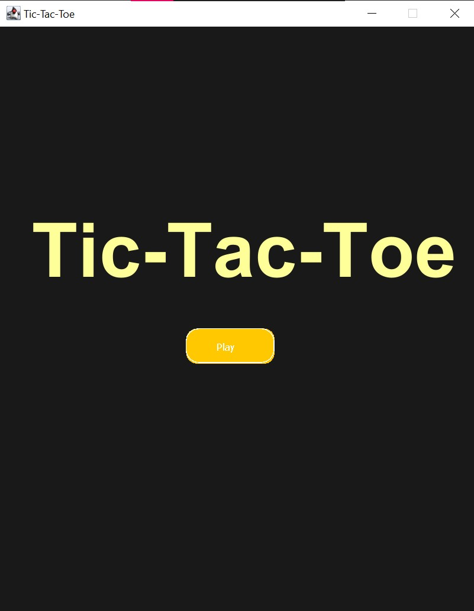
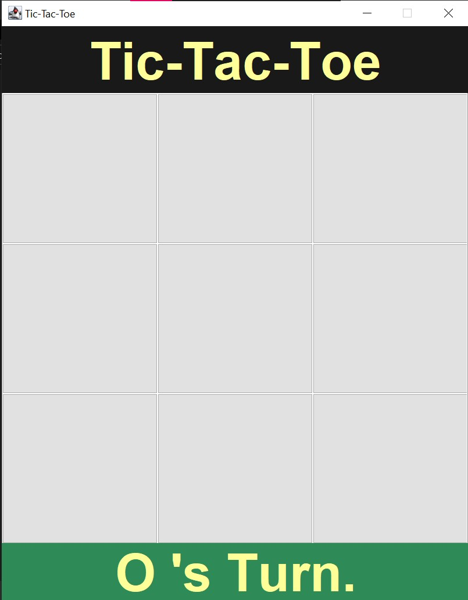

# tic-tac-toe
Basic Tic-Tac-Toe Game developed using Java Swing library

## Screenshots

<table>
  <tr>
      <td>
        
      </td>
      <td>
        
      </td>
      
  </tr>
  <tr>
  	<td>
        
    </td>
    <td>
        
      </td>
   </tr>
 </table>
